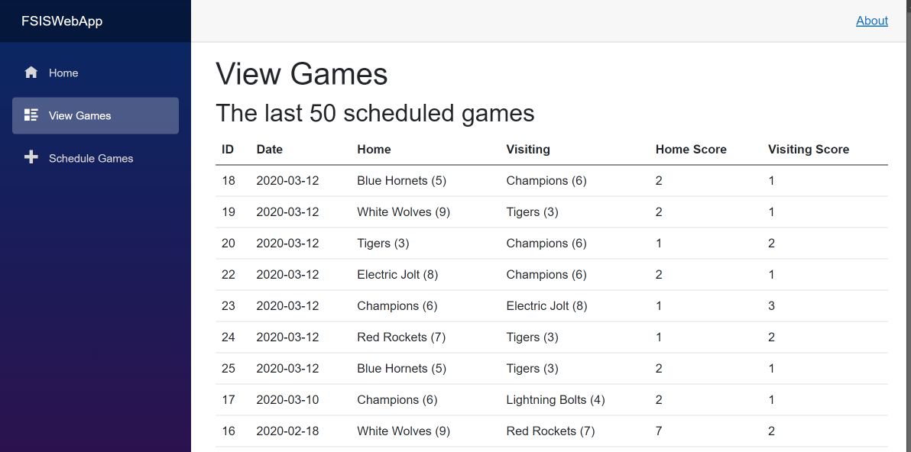
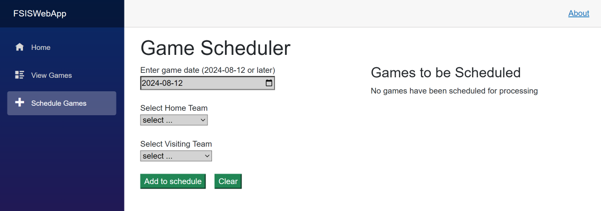
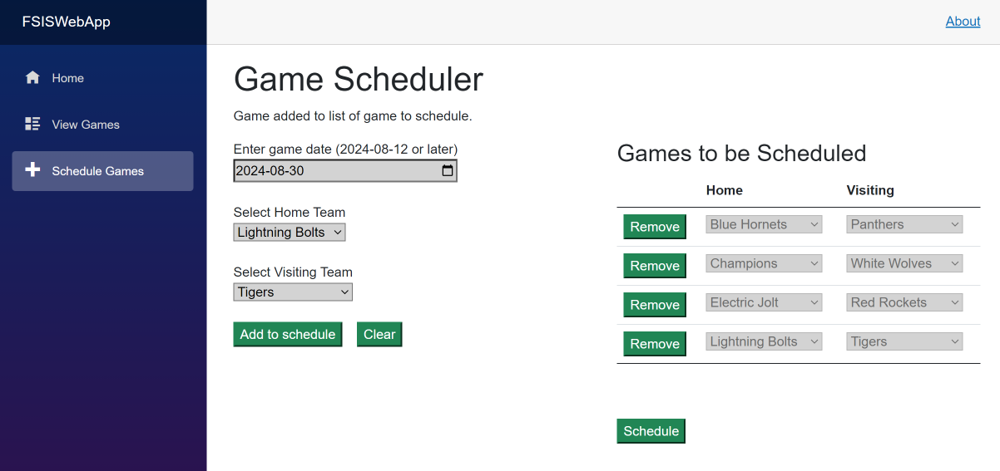
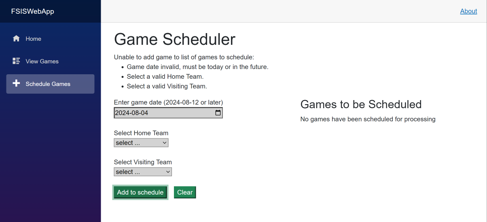
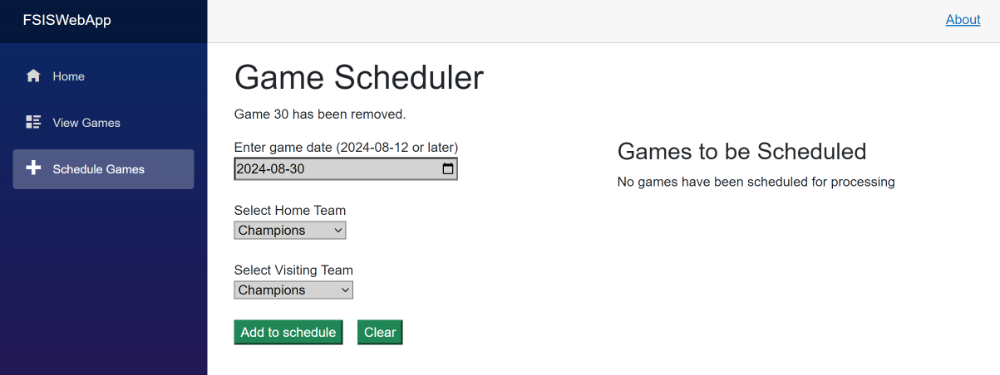
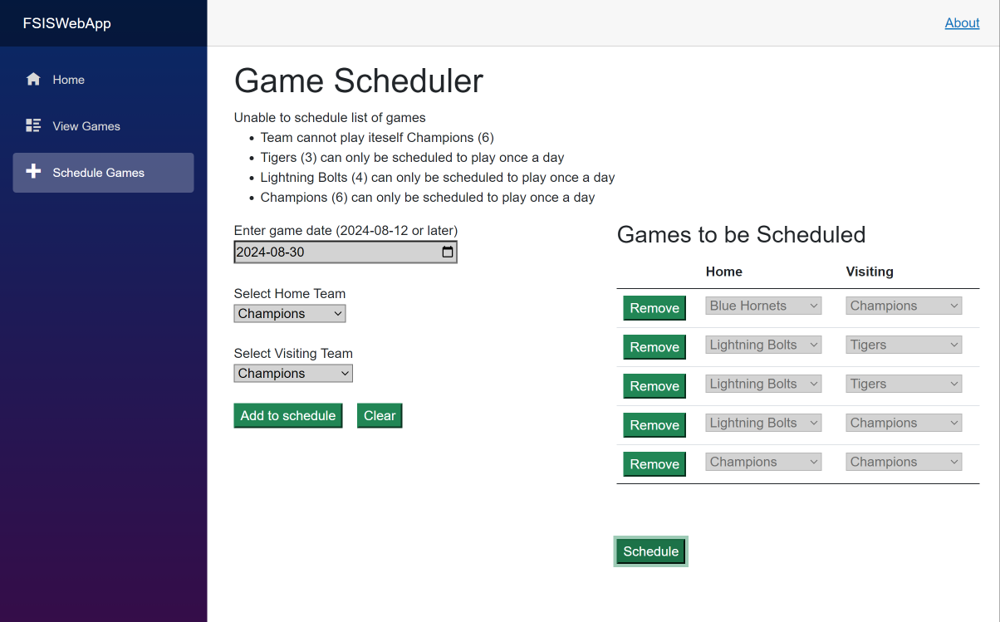
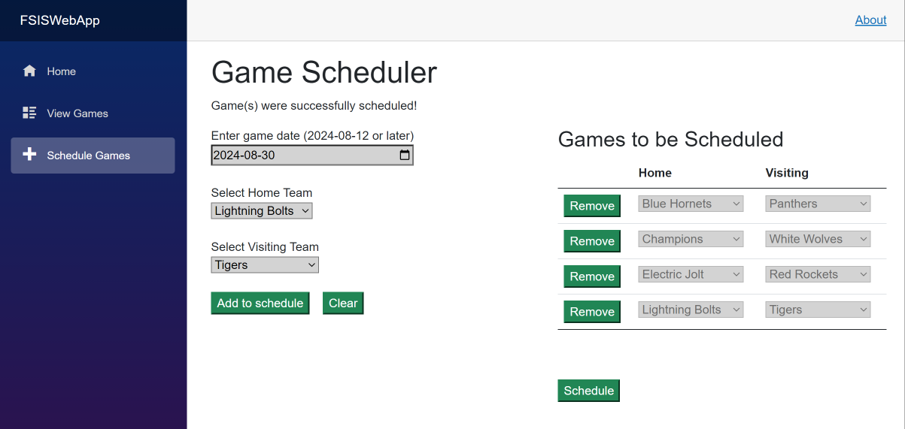
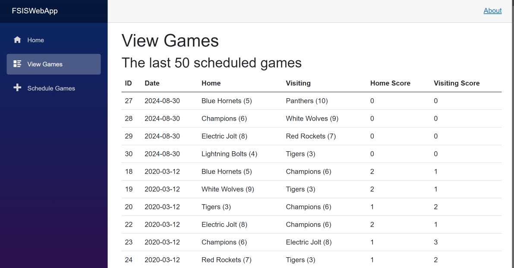
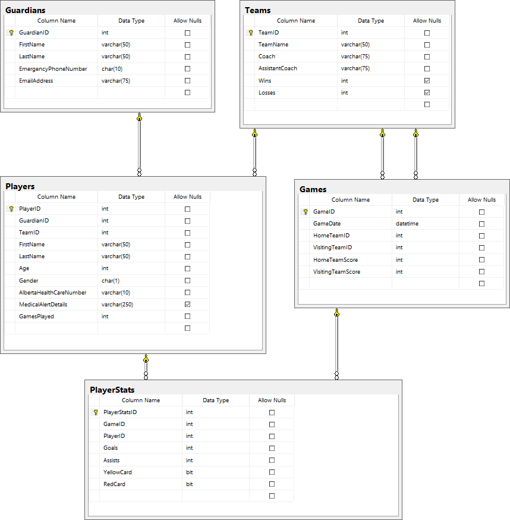

# In-Class Assessment 05 - FSIS Integrated Web/OLTP - 

> Integrated Web/OLTP services -
> **Read the entire instructions before beginning your work**


## Marking Summary

| Evaluation Item  | Weight | **Mark** | Comments |
|-------------------------------|:------:|:--------:|:--------:|
| Create web page table: Implement a table to be used to display the ScheduleView collection      | 4      | **TBD** |   |
| Code: Add to Schedule: Validate data for game schedule record     | 2  | **TBD** |   |
| Code: Add to Schedule: Add a game schedule record to the view model collection              | 2      | **TBD** |   |
| Code: Remove From Schedule: Remove a game schedule record from the view model collection                 | 2      | **TBD** |   |
| Code: Schedule: call the GameServices method to register the game schedule collection to the database   | 2      | **TBD** |   |
| User friendly error handling: able to handle a collection of errors   | 3      | **TBD** |   |
| **Penalty** -  missing commits after every 10 minutes | -4 Max    | **TBD** |   |
| Total                                                                                                      | *15*   | **TBD** |   |

### Marking Rubric

| Weight | Breakdown |
| ----- | --------- |
| **1** | 1 = **Proficient** (requirement is met)<br />0 = **Incomplete** (requirement not met, missing large portions) |
| **2** | 2 = **Proficient** (requirement is met)<br />1 = **Limited** (requirement is poorly met, minor errors)<br />0 = **Incomplete** (requirement not met, missing large portions) |
| **3** | 3 = **Proficient** (requirement is met)<br />2 = **Capable** (requirement is adequately met, minor errors)<br />1 = **Limited** (requirement is poorly met, major errors)<br />0 = **Incomplete** (requirement not met, missing large portions) |
| **4** | 4 = **Proficient** (requirement is met)<br />3 = **Capable** (requirement is adequately met, minor errors)<br />2 = **Acceptable** (most requirements are adequately met, minor errors)<br />1 = **Limited** (requirement is poorly met, major errors)<br />0 = **Incomplete** (requirement not met, missing large portions) |

----

## Database

The physical database can be installed from the `.bacpac` file included in the starter kit.

## About FSIS

> **Fort Sasquatch Indoor Soccer** is a community soccer league.

## Requirements

### Use Regular Commits

Commit your work at the end of every **Activity**. Ensure you sync your local clone to the classroom on GitHub before the end of class. The classroom access ends at
the end of class. **It is your responsibility to ensure that your work is properly submitted. Failure to submit your work will result is a mark of 0 (zero).**

### Setup

Restore the supplied SQL database by importing it as a Data-Tier Application. The database name is **FSIS_2018**. 

The database contains data for testing your solution. **You may have to alter the connection string in appsettings.json to use your Sql Server.** 

Run the solution to ensure there are no errors.  Click **View Games** in the navigation menu to see a list of the last 50 games, ordered by descending GameDate.  This will verify that the database has been successfully hooked up.



### Complete All Work in the Provided FSIS_Blazor_Assessment VS Solution

> Specifically, all code additions will be completed in **GameScheduler.razor** and **GameScheduler.razor.cs**

In this assessment, you will be demonstrating your understanding of implementing a web page capable of collecting multiple records and processing said collection in a transaction. In this assessment, you will be evaluated on the following:

- Create an HTML table capable of displaying a collection of ScheduleView data to be processed as a transaction.
- Implement various methods events to manage the web page and ScheduleView collection data.
- Complete the code necessary to cause completion of the transaction, saving the games to the database.
- Implement user friendly error handling within your methods capable of managing multiple errors.

The starting VS C# web application solution has certain portions of the assessment pre-coded. In particular, the general structure of the application has been completed, including the service methods in the system class library. **This existing code works and should not be altered.**

You are to complete each of the activities in either the GameScheduler.razor or GameScheduler.razor.cs files to complete a successful solution to this assessment. You will need to use the specified names in portions of the activities to integrate with the existing code. **This existing code works and should not be altered.**

You may need to create local variables to use in your answer (these variables can be called whatever you wish). 

The following is what **AssessmentPages/GameScheduler** looks like before you complete any of the activities.



### Activity Instructions

#### Activity 1 - Complete web page table code

A web page, **GameScheduler.razor**, has been partially coded. It requires a table to be completed that will display/manage a collection of ScheduleView data.

Create a table to display the games to be scheduled:
- Link the table to the ScheduleView gamesToSchedule collection.
- Set up a disabled dropdown list to display each team (Home and Visiting).
- Set up a Remove button which when clicked will call the Remove method using the GameID as input data. 

**View Model: ScheduleView**

``` csharp
public class ScheduleView
{
        public int GameID { get; set; }
        public int HomeTeamID { get; set; }
        public int VisitingTeamID { get; set; }
}
```

The following is what **AssessmentPages/GameScheduler** looks like including the table holding four games (this may vary) to be scheduled.
**Note:  You will not see this until you have finished Activity 2**.




#### Activity 2 - Code the method: **Add to Schedule**.

Place your code within a user friendly error handling structure (no exceptions needed at this time). The code should:

- Validate the game date to be today or in the future
- Validate a home team was selected.
- Validate a visiting team was selected.
- Generate a GameID to be used for the game to be scheduled.  This should be one more than the current game max GameID if no other games are to be scheduled.  If other games are to be scheduled, the value should be one more than the max GameID in the ScheduleView collection.
- Create a new instance to be added to the ScheduleView collection.
- Add the new ScheduleView instance to the collection.
- Issue success or failure messages.

**Ensure that you look at the "Sample Validation Errors" below**



#### Activity 3 - Code the method: **Remove From Schedule**.

Place your code within a user friendly error handling structure (no exceptions needed at this time). The code should:

- Ensure that the supplied GameID exists in the gamesToSchedule collection.
- Find the selected instance within the ScheduleView collection.
- Remove that instance.
- Issue success or failure messages.

**See the following **Remove** success**



#### Activity 4 - Code the method:  **Schedule (Save)**.

Place your code within a user friendly error handling structure (exceptions must be handled this time - thrown from the Service method). The code should: 

- Call the `GameServices_ScheduleGames(....)` method, passing in the required data.
- Issue success or failure messages.

**Sample of Validation errors from GameService method**



**Sample of Successful Scheduling of games using GameService method**



**Sample of View Games with the four new games scheduled**



# FSIS ERD




